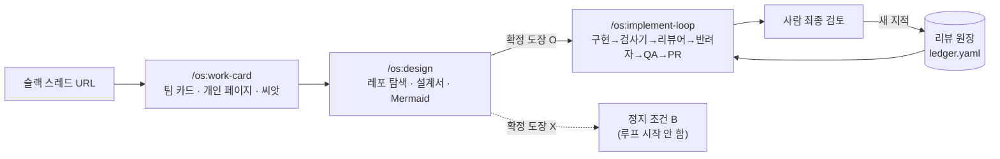
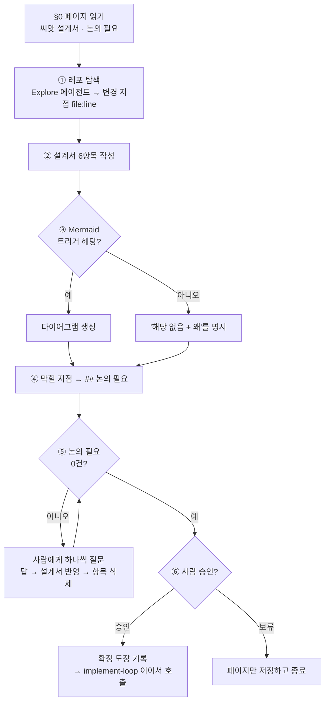

# 설계 단계 — `/os:design`

> [OS.md](../OS.md) 3절 골격의 **"[AI] 설계 초안 · 막힐 지점 지적"** 을 독립 스킬로 떼어내는 설계.
> OS.md 6절 미결 항목 **"설계서의 형식과 저장 위치"** 를 여기서 확정한다. 2026-08-30 작성.

## 0. 왜 떼어내나

설계 초안은 지금 [`plugin/skills/work-card/SKILL.md`](../plugin/skills/work-card/SKILL.md) §③에 얹혀 있다. 세 가지가 얕다.

| 지금 | 문제 |
|---|---|
| 입력이 슬랙 스레드뿐 | 레포를 열어보지 않는다. "어느 컴포넌트·어느 API"를 텍스트로 추정하고 모르면 `확인 필요`로 넘긴다 |
| 출력이 산문 4항목 | 분기가 여럿인 작업도 문장으로만 쓴다. 사람이 검토할 때 빠진 분기를 눈으로 세야 한다 |
| 확정 판정이 `## 논의 필요`가 빈 것 | **AI가 스스로 비울 수 있는 조건**이다. 질문을 안 적으면 통과한다 |

work-card가 하는 일(팀 카드 찾기 · 개인 페이지 생성 · 노션 셋업)과 설계가 필요로 하는 입력이 다르다. work-card는 슬랙과 노션만 보면 되지만 **동작 명세는 레포를 열어야 나온다.** 한 스킬에 묶어두면 둘 다 무거워진다.

그래서 work-card는 **씨앗**까지만 낸다 — 한 줄 목표와 막힐 지점 초벌. 나머지는 `/os:design`이 맡는다.

## 1. 파이프라인에서의 자리



## 2. 확정된 결정

| 쟁점 | 결정 | 근거 |
|---|---|---|
| 스킬 경계 | work-card에서 **분리**. `plugin/skills/design/` 신설 | 필요한 입력이 다르다(0절). 설계만 다시 돌리기도 쉬워진다 |
| 설계서 SSOT | **노션 개인 업무 로그 페이지 `## 설계서` 섹션 단일** | OS.md 4.6 "md 파일은 방치되면 레거시가 된다". 싱크 지점이 하나여야 어긋나지 않는다 |
| Mermaid 위치 | 노션 code block (`language: mermaid`) | 노션이 그 자리에서 렌더한다. 원본과 그림이 같은 곳에 있다 |
| 다이어그램 규칙 | **조건부.** 트리거 표에 해당할 때만 (4절) | 사소한 작업에 다이어그램이 붙으면 설계서 자체의 신뢰도가 떨어진다 |
| 확정 판정 | **명시적 승인 도장.** 본문 quote 블록 (5절) | OS.md 1절 "사람의 꼼꼼한 검토를 통과해야만 확정" |

## 3. 내부 흐름

단계 표기는 implement-loop의 관례를 따른다 — `§0`은 시작 전 확인, 실제 단계는 `①②③`. 이 문서의 절 번호(`1.`·`2.`…)와 겹치지 않게 하기 위함이다.



**⑤가 ⑥ 앞에 있는 것이 요점이다.** 답이 안 나온 항목을 남긴 채로는 승인 질문 자체가 성립하지 않는다. "이 설계 괜찮나요?"를 물으면서 "그런데 3번은 아직 모릅니다"를 같이 내밀면, 사람은 모르는 채로 승인한다.

### 각 단계

| 단계 | 하는 일 | 멈추는 조건 |
|---|---|---|
| §0 | `notion-home` `API-retrieve-page-markdown`으로 페이지를 읽어 `## 설계서` 씨앗과 `## 논의 필요`를 확보 | 페이지 접근 실패 |
| ① | 레포 경로를 정하고 `Explore` 에이전트로 변경 지점을 `file:line`까지 특정 | 레포 경로를 정할 수 없음 |
| ② | 설계서 6항목 작성 (4절) | — |
| ③ | 트리거 표(4절)에 따라 다이어그램 생성 또는 "해당 없음" 기록 | — |
| ④ | 레포에서 확인되지 않은 것을 `## 논의 필요`로 | — |
| ⑤ | `AskUserQuestion`으로 한 건씩 해소. 답을 받을 때마다 설계서에 반영하고 항목 삭제 | 사용자가 "나중에"를 고름 |
| ⑥ | 승인을 묻고, 승인받으면 도장을 찍고 `/os:implement-loop` 호출 | 보류 |

**레포 경로 판정**은 work-card의 프로젝트 판정 표를 그대로 쓴다. 경로를 정할 수 없으면 `--repo`로 받고, 그것도 없으면 ①을 건너뛰고 AS-IS·변경 지점을 통째로 `## 논의 필요`에 넣는다. 추측해서 파일명을 쓰지 않는다 — 틀린 `file:line`은 없는 것보다 나쁘다. 구현자가 그 파일을 찾다가 시간을 버린다.

## 4. 설계서 6항목

work-card의 4항목에서 둘이 늘어난다. 늘어난 쪽이 레포를 봐야만 쓸 수 있는 것들이다.

| 항목 | 내용 | 출처 |
|---|---|---|
| 한 줄 목표 | 스레드가 요청한 것 | work-card 씨앗 |
| **AS-IS** | 지금 이 화면·흐름이 어떻게 도는가 | **레포 탐색** |
| **TO-BE** | 무엇이 어떻게 달라지는가 | 스레드 + 탐색 |
| **변경 지점** | `path/File.tsx:120` 수준의 파일 목록 | **레포 탐색** |
| 동작 명세 | 입력·상태·분기 표 | 스레드 |
| 범위 밖 | 이번에 안 하는 것 | 스레드 |

### Mermaid 조건부 트리거

판단 여지를 남기지 않는 것이 목적이다. 스킬에 이 표를 그대로 박는다.

| 트리거 | 그리는 것 | 안 그리는 경우 |
|---|---|---|
| 조건 분기 **2개 이상** (상태·권한·플랫폼) | `flowchart TD` | 분기 1개 이하 |
| 프론트↔서버 또는 웹↔브릿지 왕복 **2회 이상** | `sequenceDiagram` | 단일 조회 |
| 화면·컴포넌트 상태 **3개 이상** | `stateDiagram-v2` | 상태 2개 이하 |
| 새 파일 **3개 이상** 또는 모듈 경계 변경 | `flowchart LR` | 단일 파일 수정 |

전부 미해당이면 다이어그램은 **0개**다. 다만 그때도 설계서에 한 줄을 남긴다.

```
다이어그램: 해당 없음 (분기 1개 · 단일 파일)
```

안 그린 것이 **판단의 결과인지 빠뜨린 것인지**를 사람이 구별할 수 있어야 한다. 이 한 줄이 없으면 검토자는 매번 "다이어그램이 있어야 하는 작업 아닌가?"를 스스로 되물어야 한다.

## 5. 확정 도장

노션 개인 업무 로그 DB의 속성은 `이름`·`프로젝트`·`상태`·`작업 시작 날짜`·`메모 / 일정`·`TODO`·`PR`·`우선순위`·`평가`·`회고`·`블로그 소재`·`Blocking`·`ID`다. 설계 확정을 담을 자리가 없다.

| 안 | 방식 | 판정 |
|---|---|---|
| (a) 새 속성 `설계 확정`(date) | 목록 뷰에서 바로 보임 | ✗ work-card가 명시한 "OS 편의로 열을 늘리면 사람 쪽이 불편해진다"와 충돌 |
| (b) `상태`에 옵션 추가 | 기존 열 재사용 | ✗ `상태`는 매일 보는 핵심 열. OS 전용 값이 섞이면 오염 |
| (c) **본문 quote 블록** | `## 설계서` 첫 줄 | ✓ 채택 |

```
> 설계 확정 · 2026-08-30 14:20 · 사람 승인
```

**(c)를 고른 이유** — 확정 여부가 필요한 시점은 루프 시작 순간 하나뿐이고, 그때 implement-loop는 어차피 `API-retrieve-page-markdown`으로 본문을 읽는다. 추가 API 호출이 0이고 스키마 변경도 0이다. 목록 뷰에서 안 보인다는 단점은, 목록 뷰에서 볼 일이 없으므로 비용이 아니다.

### 강제력의 한계 — 명시해 둘 것

어느 안을 골라도 **AI는 기술적으로 자기 도장을 찍을 수 있다.** 속성이든 본문이든 같은 API로 쓴다. 이건 규칙이지 기계적 강제가 아니다.

진짜로 막으려면 OS.md 4.2의 "원장 항목 → 검사기 승격"과 같은 방식으로 검사기가 도장의 출처를 검증해야 한다. **이번 범위 밖으로 둔다.** 대신 두 가지를 건다.

- 스킬의 `## 하지 않는 것`에 **"`AskUserQuestion` 승인 응답 없이는 도장을 찍지 않는다"** 를 명시
- 도장 줄에 **승인 시각**을 남겨, 나중에 페이지 편집 이력과 대조할 수 있게 함

## 6. 다른 스킬에 미치는 변경

| 파일 | 변경 |
|---|---|
| `plugin/skills/design/SKILL.md` | **신설** |
| `plugin/skills/work-card/SKILL.md` | §③을 씨앗까지로 축소. 마지막 질문의 다음 단계를 `/os:implement-loop` → **`/os:design`** 으로 |
| `plugin/skills/implement-loop/SKILL.md` | §0-3 확정 판정에 **확정 도장 확인** 추가. 도장이 없으면 정지 조건 B이며, 안내를 "`/os:design`을 먼저 실행"으로 |
| `OS.md` | 6절 "설계서의 형식과 저장 위치" 체크. 4절에 설계 단계 항 추가 |
| `docs/orchestrator-plan.md` | 1절 파일 구조에 `design/` 추가 |

implement-loop은 이번에 **별개의 변경 하나를 더 받는다** — 대상 레포가 cashwalk 밖이면 implement-loop의 ②~⑤ 퀄리티 판정 구간을 통째로 건너뛰는 분기. 주제가 다르므로 [docs/orchestrator-plan.md](./orchestrator-plan.md)의 "프로젝트별 루프 범위" 절에 따로 적었다. 같은 파일을 고치므로 구현 시점에 함께 반영한다.

work-card의 마지막 질문이 바뀌는 것이 눈에 잘 안 띄는 변경이다. 지금은 `논의 필요`가 0건이면 곧장 implement-loop을 부르는데, 그 자리에 `/os:design`이 들어가야 한다. 이걸 놓치면 설계 단계를 만들어놓고 **아무도 부르지 않는다.**

## 7. 왜 이렇게 나눴나

- **설계를 별도 스킬로 둔 이유** — 설계만 다시 돌릴 수 있어야 한다. 지금 구조에서 설계가 틀렸다는 걸 구현 중에 알면, work-card를 다시 부르는 것은 노션 페이지 셋업까지 다시 하는 일이다. 재실행 단위가 곧 스킬 경계다.

- **다이어그램을 조건부로 둔 이유** — 로그인 버튼 텍스트를 바꾸는 작업에 시퀀스 다이어그램이 붙으면, 읽는 사람은 설계서 전체를 형식적인 것으로 취급하기 시작한다. 다이어그램이 있다는 사실 자체가 "이건 복잡한 작업"이라는 신호여야 값이 있다.

- **"해당 없음"까지 적게 한 이유** — 조건부 규칙의 약점은 침묵이 모호하다는 것이다. 없는 것이 판단인지 누락인지 구별되지 않으면, 검토자가 매번 규칙 표를 스스로 다시 돌려야 한다.

- **⑤를 ⑥ 앞에 둔 이유** — 미해결 항목을 옆에 두고 승인을 물으면 사람은 그것을 포함해 승인해버린다. 설계 권한을 사람에게 남긴다는 원칙이 형식만 남는다.

- **강제력의 한계를 문서에 적은 이유** — 도장이 기계적 강제라고 착각하면, 나중에 "도장이 있으니 검토된 것"이라는 잘못된 신뢰가 생긴다. 한계를 적어두면 그것이 다음 검사기 승격의 후보 목록이 된다.
