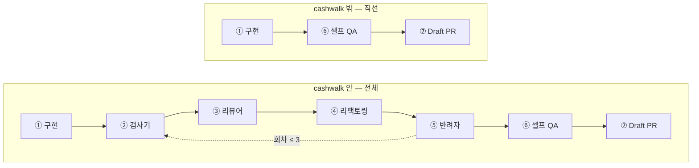

# 오케스트레이터 구축 계획

> [OS.md](../OS.md) 3절 골격을 실제 파일로 옮기는 계획. 2026-08-28 점검 결과를 바탕으로 작성.
> 원칙: **부품 먼저, 최소로.** 오케스트레이터(3주차)는 원장·리뷰어·검사기(1·2주차) 위에 얹는다.

## 0. 점검에서 확정한 것

| 쟁점 | 결정 | 근거 |
|---|---|---|
| 진행 순서 | 원장 v0 → 검사기 v0 → 리뷰어/반려자 에이전트 → 오케스트레이터 | 원장 없는 오케스트레이터는 판정 기준이 빈 껍데기 |
| 전역 스킬 연결 | **이름으로 참조.** 복사·symlink 하지 않는다 | symlink는 다른 PC·조별 리뷰에서 끊기고 이중 로드됨. 복사는 7절 동기화 문제를 OS 안으로 끌어들임 |
| 원장 소스 | **노션 "코드 리뷰 문서화 DB"(30건)** 가 적립층. 레포 `ledger.yaml`이 실행층 | 이미 `/guesung:review-feedback-log`가 채우고 있는 자산. 다만 노션엔 `검증법`·`재발` 필드가 없어 실행층이 따로 필요 |
| 설계 문서 위치 | 이 레포 `docs/` | 노션 원장의 "스펙은 레포에 커밋하지 않는다" 규칙은 업무 레포 대상. 이 레포는 CLAUDE.md 1번이 우선 |

### 전역(SSOT)과 레포의 경계

```
~/.claude/skills/guesung/        (전역 플러그인, ~/.claude git 레포로 버전 관리됨)
  범용 스킬 — spec-build · full-review · ui-verify · pr · review-feedback-log · advance-code
        ▲ 이름으로 호출 (/guesung:xxx)
        │
my-claude-code-os/               (이 레포)
  OS 고유 부품 — 원장 · 검사기 · 리뷰어/반려자 에이전트 · 오케스트레이터
  plugin/dependencies.md — 필요한 전역 스킬 목록. 검사기가 시작 시 존재 확인
```

OS.md 4.9에 적힌 `/self-qa-checklist`는 전역에 존재하지 않는다. 셀프 QA는 `/guesung:ui-verify`로 대체한다.

## 1. 목표 파일 구조

OS 부품은 전부 `plugin/` 아래에 모은다. 이 폴더가 **플러그인 루트**이며 자기완결적이다 — 다른 레포에서 `claude --plugin-dir <이 레포>/plugin`으로 띄우면 `/os:ledger-check` 등으로 로드된다. `.claude/skills/`는 이 레포 자체를 관리하는 스킬(gh-commit 등) 전용이라 플러그인에 넣지 않는다.

```
my-claude-code-os/
├── plugin/                         # 플러그인 루트. name: os
│   ├── .claude-plugin/plugin.json
│   ├── dependencies.md             # 전역 스킬 의존 목록. 검사기가 읽는다
│   ├── ledger/
│   │   ├── ledger.yaml             # 실행 원장 v0
│   │   └── fixtures/
│   │       └── violations.diff     # 검사기·리뷰어 검증용. 원장 항목을 일부러 위반한 diff
│   ├── skills/
│   │   ├── work-card/              # 슬랙 URL → 팀 카드 찾기 → 개인 페이지 생성 → 설계서 씨앗
│   │   ├── design/                 # 레포 탐색 → 설계서 6항목 + 조건부 Mermaid → 사람 승인 도장
│   │   ├── self-qa/                # QA 명세 → 노션 QA 항목 DB → 자동 판정(ui-verify) / 수동 재현 방법
│   │   ├── ledger-check/           # 검사기 v0
│   │   │   ├── SKILL.md
│   │   │   └── scripts/ledger_check.py
│   │   ├── ledger-promote/         # 노션 → 원장 승격, 폐기, 재발 카운트 (4주차)
│   │   └── implement-loop/         # 오케스트레이터 (3주차)
│   │       └── SKILL.md
│   └── agents/
│       ├── ledger-reviewer.md      # 리뷰어: 원장 + 컨벤션 기준으로만 판정
│       └── rejector.md             # 교차 컨펌: diff만 보고 "반려 근거"를 찾는다
├── .claude/skills/                 # 레포 관리용 (gh-commit, skill-stat)
├── docs/orchestrator-plan.md       # 이 문서
└── OS.md
```

원장 파싱은 pyyaml 없이 스크립트 내장 최소 파서로 한다(외부 의존 0). 원장은 "리스트 → 2단 매핑 → 스칼라 또는 `>-` 블록" 서브셋만 쓴다.

## 2. 작업 카드 — 팀 카드와 개인 페이지 (노션, SSOT)

작업 하나 = 슬랙 스레드 하나. 그 URL을 키로 두 노션이 묶인다. 레포 안에 md로 상태를 남기지 않는다(OS.md 4.7).

```
슬랙 스레드 URL
   ├─ 팀: 1파트 작업 스레드 모음 ──relation──▶ 1파트 작업리스트 (팀 카드)   ← 읽기 전용
   └─ 개인: 업무 로그 DB 페이지 (슬랙 URL은 `이름`의 링크)                          ← OS가 읽고 쓰는 곳
```

| | 워크스페이스 | MCP | OS 역할 |
|---|---|---|---|
| 팀 카드 `1파트 작업리스트` | cashwalkteam | `claude.ai Notion` | 상태·담당자·PR — **팀이 보는 것. AI는 읽기만** |
| 스레드 모음 `1파트 작업 스레드 모음` | cashwalkteam | `claude.ai Notion` | 슬랙 URL → 팀 카드 찾기 |
| 개인 페이지 `업무 로그` | guesung | `notion-home` | 설계서·TDL·논의·루프 로그 — **상황 공유 전부 여기** |
| QA 항목 DB (📜 문서 › QA 체크리스트) | guesung | `notion-home` | 모든 작업의 QA 항목이 행으로. `작업` relation으로 업무 로그와 연결 |

개인 DB는 `claude.ai Notion` MCP로는 404. 두 MCP를 구분해 써야 한다.

개인 페이지 본문 섹션 (제목 고정 — 스킬이 제목으로 찾는다):

| 섹션 | 쓰는 쪽 | 읽는 쪽 |
|---|---|---|
| `## 설계서` | `/os:work-card`가 씨앗 → `/os:design`이 레포를 열어 6항목·다이어그램 → 사람 승인 도장 | ① 구현. **도장이 없으면 루프가 시작하지 않는다** |
| `## TDL` | implement-loop가 설계서에서 뽑고 회차마다 체크. 속성 `TODO`에 남은 건수 미러링 | ① 구현, 사람의 진행 파악 |
| `## QA 체크리스트` | `/os:self-qa`가 설계서에서 뽑아 **노션 "QA 항목" DB**(📜 문서 › QA 체크리스트 페이지 안 인라인 DB)에 행으로 쌓음. 페이지엔 링크·요약만 | ⑥ 셀프 QA. 자동은 ui-verify로 판정, 수동은 재현 방법과 함께 사람에게 |
| `## 논의 필요` | work-card의 "막힐 지점" 초벌 + design이 레포를 보고 추가한 것 + 루프 중 가정·WARN·FF 제안 | 사람. **비어 있어야 루프가 시작된다** |
| `## 루프 로그` | 회차별 검사기·리뷰어·반려자 판정 요약 | 사람의 최종 검토, 4주차 재발률 집계 |

- 루프 **상태**(현재 회차 등)는 `.omc/state/implement-loop.json`에 두되, 사람이 볼 **기록**은 페이지의 루프 로그에 남긴다. 상태는 휘발돼도 되고 기록은 남아야 하기 때문에 둘을 나눈다.
- 팀 카드 상태 변경(`QA 대기` 등)·PR 연결은 사람이 한다. implement-loop는 마지막 출력에 "팀 카드 갱신 필요"를 한 줄 남길 뿐이다.

## 3. 원장 스키마 (`ledger/ledger.yaml`)

```yaml
- id: L-001
  규칙: useCallback / useMemo 를 습관적으로 붙이지 않는다
  출처: ~/.claude/CLAUDE.md 핵심 규칙 9        # 노션 항목이면 페이지 URL
  검증:
    type: grep                                # grep | ast | judgment
    pattern: '\b(useCallback|useMemo)\('
    scope: added                              # added(추가 라인) | files(변경 파일 전체)
    glob: '**/*.{ts,tsx}'
  중요도: 높음
  재발: 0
```

- `type: grep` — 검사기가 기계로 판정. 발견 즉시 FAIL.
- `type: ast` — ast-grep 패턴. v0에서는 비워두고 스키마만 예약.
- `type: judgment` — 기계 판정 불가. 리뷰어 에이전트에게 지침으로만 전달. `pattern` 대신 `판정 기준` 한 줄.
- `재발` — 최종 리뷰에서 사람이 같은 걸 다시 지적하면 +1. 4주차 채점 지표.

### v0 후보 (노션 30건 + 전역 컨벤션에서 grep 가능한 것)

| id | 규칙 | 검증 |
|---|---|---|
| L-001 | useCallback/useMemo 습관적 사용 금지 | grep `useCallback\|useMemo` |
| L-002 | 테스트 코드는 작성하지 않는다 | 변경 파일명에 `.test.`/`.spec.` |
| L-003 | 외부 fetch는 공통 fetchClient를 쓴다 | 추가 라인에 `fetch(` (fetchClient 파일 제외) |
| L-004 | 인라인 svg는 파일로 분리해 import한다 | 추가 라인에 `<svg` |
| L-005 | Tailwind 임의값 대신 기본 스케일 | grep `\[[0-9.]+(px\|rem)\]` |
| L-006 | 레거시 CSS를 `is:global`로 통째로 옮기지 않는다 | 추가 라인에 `is:global` |
| L-007 | export 대상에 JSDoc | `export` 직전 줄이 `*/`가 아님 (regex, 오탐 허용) |
| L-008 | 비밀값 아닌 설정은 env 대신 코드 상수 | grep `process.env\|import.meta.env` → **judgment로 승격 필요**(비밀값인지 사람이 봐야 함) |

나머지 22건 중 "이름은 구체적으로", "범용 유틸과 도메인 로직 분리" 같은 것은 `judgment`로 5개 내외만 골라 넣는다. 전부 옮기지 않는다 — 리뷰어 컨텍스트가 비대해지면 판정이 흐려진다.

## 4. 단계별 작업

각 단계는 **독립적으로 검증 가능**해야 다음 단계로 간다.

### Step 1 — 원장 v0 (1주차)

- `ledger/ledger.yaml` 수기 작성. grep 5~8개 + judgment 5개 내외.
- `ledger/fixtures/violations.diff` — 각 grep 항목을 정확히 하나씩 위반하는 diff.
- **검증**: 없음(데이터). Step 2가 검증한다.

### Step 2 — 검사기 v0 (2주차)

- `ledger_check.py`: `ledger.yaml`을 읽고 `git diff <base>...HEAD`(또는 인자로 받은 diff 파일)에 grep 항목을 실행. 항목별 `PASS/FAIL + 파일:라인` 출력, `--json` 옵션.
- 시작 시 `plugin/dependencies.md`의 전역 스킬 존재 확인. 없으면 실행 전에 멈춘다.
- `SKILL.md`: "원장 검사", "ledger check" 트리거. 결과를 표로 보여주기만 하고 고치지 않는다.
- **검증**: fixture로 돌려 grep 항목 전부 FAIL, 깨끗한 diff로 돌려 전부 PASS. ✅ 2026-08-28 — fixture 7 FAIL(각 1건) / 빈 diff 7 SKIP / JSDoc 면제 케이스 통과 / `claude plugin validate` 통과

### Step 3 — 리뷰어 에이전트 (2주차)

`.claude/agents/ledger-reviewer.md`

- 입력: diff + `ledger.yaml`의 judgment 항목 + 검사기 JSON 결과.
- 출력: 항목별 `PASS/FAIL/N.A. + 근거 라인`. **원장·컨벤션에 없는 지적은 금지** — 범위 규율이 없으면 리뷰어가 매번 다른 걸 지적해 루프가 수렴하지 않는다.
- 별도 컨텍스트(Agent 도구)로 실행. 구현자의 대화 내용을 보지 않는다.
- **검증**: fixture로 실행해 judgment 항목 중 명백한 위반을 잡는지 확인. ✅ 2026-08-28 — L-101 FAIL 2건(`isOpen`·`handleClick`), L-102 FAIL 1건, L-103~106 N.A. 범위 밖 지적·총평 없음. 출력 형식 준수

### Step 4 — 반려자 에이전트 (2주차 후반)

`.claude/agents/rejector.md`

- 입력: **diff만.** 설계서·리뷰어 결과를 주지 않는다.
- 임무: "이 PR을 반려시킬 근거를 찾아라". 못 찾으면 "반려 근거 없음"과 함께 **diff에서 읽어낸 의도**를 한 문단으로 쓴다 → 가독성 테스트.
- **검증**: fixture에서 의도가 올바로 읽히는지, 억지 반려를 만들어내지 않는지 2~3회 돌려본다. ✅ 2026-08-28 1회 — 의도 "프로모 배너 추가"로 복원, 확신도 낮음(훅↔Astro 미연결 지목). 반려 근거 5건 전부 동작 결함(fetch 무처리·비배열 응답·`section` 전역 셀렉터·닫기 경로 부재·항상-통과 테스트). 취향 지적 없음
- 반려자 근거가 원장 항목(L-002·L-006)과 겹칠 수 있다. 관점이 다르므로(규칙 위반 vs 실제 결과) 문제 아님. **중복 합치기는 오케스트레이터 책임**으로 둔다

### Step 4.5 — 설계 단계 (`/os:design`)

`plugin/skills/design/SKILL.md`. work-card §③에 얹혀 있던 설계 초안을 떼어내 독립 스킬로 만든다. 설계·근거는 [design-stage.md](./design-stage.md).

- work-card는 **씨앗**(한 줄 목표 · 막힐 지점 초벌)까지만. 본격 설계서는 design이 레포를 열어 채운다 — 필요한 입력이 다르고, 설계만 다시 돌릴 수 있어야 한다.
- 출력은 6항목(목표 · AS-IS · TO-BE · 변경 지점 `file:line` · 동작 명세 · 범위 밖) + **조건부 Mermaid**. 트리거 미해당이면 "해당 없음 + 이유"를 남긴다.
- `## 논의 필요`를 0건으로 만든 **뒤에** 승인을 묻는다. 미해결 항목을 옆에 두고 물으면 사람이 그것까지 포함해 승인한다.
- 승인 시 `## 설계서` 첫 줄에 quote 도장(`> 설계 확정 · <시각> · 사람 승인`). implement-loop §0-3이 이 도장을 시작 게이트로 쓴다.
- **검증**: ⏳ 미실행. 슬랙 스레드 1개로 work-card → design → 도장까지 돌려봐야 한다.

### Step 5 — 오케스트레이터 (3주차)

`.claude/skills/implement-loop/SKILL.md`. 상태 파일 `.omc/state/implement-loop.json`에 회차·판정을 기록.

```
[사람] 설계서 확정
   │
   ▼
① 구현          /guesung:spec-build 또는 직접. 카드의 설계서·TDL을 읽는다
② 검사기        /ledger-check          ─┐
③ 리뷰어        ledger-reviewer         │  하나라도 FAIL → ④ → ②로
④ 리팩토링      (a) FAIL 항목 수정 — 필수 │  회차 ≤ 3. 초과 시 멈추고 사람에게
               (b) FF 기준 개선 제안 — 선택 │  조기 종료: 전부 PASS + 반려 없음 + (b) 제안 없음
⑤ 반려자        rejector               ─┘  반려 근거 있음 → ④로 (회차 공유)
⑥ 셀프 QA       /os:self-qa --run      자동은 ui-verify, 수동은 재현 방법. 결과는 QA 항목 DB에
⑦ 테섭 배포     /guesung:md            develop 머지 & origin push. develop 없으면 건너뜀
⑧ Draft PR      /guesung:pr            base가 develop이면 diff가 비므로 멈추고 묻는다
   │
   ▼
[사람] 최종 검토 + 수동 QA → 지적 → /guesung:review-feedback-log → 노션 → (4주차) ledger 승격
```

- 회차 상한 3은 ②~⑤ 전체를 한 회차로 센다. **상한이지 고정이 아니다** — 종료 조건을 만족하면 1회차에도 끝난다.
- ④(a)와 ④(b)는 성격이 다르다. (a)는 원장·컨벤션 **위반**이라 반드시 고친다. (b)는 [Frontend Fundamentals](https://github.com/toss/frontend-fundamentals)(가독성·예측 가능성·응집도·결합도) 기준으로 **더 나은 코드가 될 수 있는지**를 제안하는 것이라, 적용 여부는 사람이 고른다. 둘을 섞으면 "위반"과 "취향"이 구분되지 않아 원장이 오염된다.
- (b)는 전역 스킬 `/guesung:advance-code`로 분리한다. 토스 공식 FF 플러그인의 스킬 4개 본문을 `references/`로 가져와 직접 관리하고(플러그인 의존 없음), 전역 컨벤션·원장과 충돌하는 FF 패턴(매직 넘버 상수화·도메인 폴더 이동 등)은 명시적 필터 표로 걸러낸다. FF 4원칙 각각에 대해 변경분을 대조하고 "현재 → 제안 → 근거(FF 문서 링크)" 형태로만 낸다. 자동으로 고치지 않는다.
- 사람 개입은 **시작(설계서)과 끝(최종 검토)** 두 번. (b)의 제안 선택은 최종 검토에 합친다.
- **⑦을 ⑧보다 앞에 둔다.** 테섭에 먼저 올려 실물로 확인받고 PR은 그 뒤다. `origin/develop` push는 되돌리기 어려우므로 §0에서 고지하고(`--skip-deploy`로 끌 수 있다), 매 실행마다 묻지는 않는다 — 루프를 시작한 사람의 답은 항상 같기 때문이다.
- **마지막 출력은 수동 QA를 개수가 아니라 목록으로 낸다.** 배포 알림을 받은 자리에서 바로 확인에 들어갈 수 있어야 한다.
- **검증**: 실제 대상 레포에서 작은 기능 1개를 end-to-end로 돌린다. → 이 시점에 §6의 미결 사항을 확정해야 한다.
  - ✅ 2026-08-28 — `plugin/skills/implement-loop/SKILL.md` 작성. 다른 cwd에서 `claude --plugin-dir …/plugin -p`로 헤드리스 세션을 띄워 `/os:ledger-check`가 로드·실행되는 것 확인
  - ✅ 2026-08-28 — `/os:self-qa` 추가. OS.md 4.5의 "QA 명세서 작성 → 자동 QA → 수동 안내"를 맡는 부품. 노션 QA 항목 DB 생성(12속성)
  - ✅ 2026-08-28 — `/os:work-card` 추가. 입력을 슬랙 URL | 개인 페이지 URL | 로컬 설계서로 확장. 팀 카드 읽기 전용, 상황 공유는 개인 `업무 로그` 페이지로
  - ⏳ end-to-end 미실행. 슬랙 스레드 1개로 work-card → 설계서 확정 → implement-loop 순서로 돌려봐야 한다

### 프로젝트별 루프 범위 — cashwalk 안/밖

위 ①~⑦을 **모든 레포에서 똑같이 돌리지 않는다.** 대상 레포가 `~/Desktop/레포지토리/cashwalk/**` 안이면 전체를, 밖이면 ②~⑤를 통째로 건너뛴다.



**판정**은 `/os:work-card`의 프로젝트 판정 표와 같은 경로 규칙을 쓴다. 대상 레포 경로가 `레포지토리/cashwalk/` 아래면 `안`, 그 외(`레포지토리/guesung/**` 등)는 `밖`. 경로를 정할 수 없으면 **안전한 쪽(안)** 으로 친다 — 필요 없는 검사를 도는 비용이, 필요한 검사를 빠뜨리는 비용보다 싸다.

**왜 ⑤만이 아니라 ②~⑤ 전부인가.** ②~⑤는 서로 물려 있어 중간만 빼면 나머지가 헛돈다. ④ 리팩토링은 ②③이 낸 FAIL 목록을 고치는 단계라, ②③을 남기고 ④만 끄면 **FAIL을 찾아놓고 안 고치는** 상태가 된다. 목적이 "cashwalk 밖에서는 코드 퀄리티를 크게 신경 쓰지 않는다"이므로, 퀄리티 판정 구간 전체가 대상이다.

**⑥ 셀프 QA는 양쪽 모두 유지한다.** QA는 코드 퀄리티가 아니라 "기능이 제대로 도는가"라는 **동작 검증**이고, 이건 다른 축이다. 개인 프로젝트라고 깨진 상태로 PR을 올리고 싶지는 않다.

건너뛰기가 만드는 파급. "그냥 건너뛴다" 한 줄로 끝나지 않는 곳들이다.

| 무엇 | cashwalk 안 | cashwalk 밖 |
|---|---|---|
| 루프 구조 | `round`·`max_rounds`·`rounds[]` | **루프가 아니라 직선.** 상태 파일에서 회차 개념이 빠진다 |
| 종료 판정 | ② FAIL 0 · ③ FAIL 0 · ⑤ 반려 없음 | 판정 대상 자체가 없다 |
| ⑥ QA FAIL 처리 | 고치고 **②부터 한 회차 더** | 고치고 **QA만** 다시 |
| ⑦ PR 검증 섹션 | 원장 결과표 · 회차 추이 · 반려 판정 | 빌드·타입체크 결과와 QA PASS/FAIL |
| 정지 조건 A (회차 소진) | 적용 | **없다.** A는 cashwalk 전용 조건이 된다 |

이 분기가 뜻하는 것 하나를 명시해 둔다. **cashwalk 밖 작업은 원장에 기여하지도, 원장을 쓰지도 않는다.** 이는 오히려 일관적이다 — `ledger.yaml`은 회사 코드리뷰에서 받은 지적으로 채워지는 팀 기준이라, 개인 프로젝트에 그대로 대면 맞지 않는 판정이 나온다. [OS.md](../OS.md) 1절의 "리뷰 지식을 먹고 자란다"는 축은 **cashwalk 안에서만 도는 축**이다.

### Step 6 — 되먹임 자동화 (4주차)

- `/os:ledger-promote` — 노션 → `ledger.yaml` 승격. LLM이 후보 대조·grep/judgment 분류·초안, 사람 승인, 스크립트가 쓰기·검증. **grep 항목은 fixture 위반 줄 없이는 거부**, 검사기로 FAIL 증가를 확인하고 실패 시 되돌림. 폐기는 `ledger/retired.yaml`로. `--recur <id>`로 재발 +1.
  - ✅ 2026-08-28 — 스크립트 시나리오 검증: add(grep+judgment) FAIL 7→8 / recur / 중복 출처 거부 / fixture 없는 grep 거부 / pattern 미매치 시 되돌림 / retire 후 FAIL 7 복귀
  - ⏳ 노션 실데이터로 승격 1회 미실행
- 재발률 리포트 — 미구현. `재발` 필드를 집계해 주차별 숫자로.

## 5. 각 단계에서 배우는 것

CLAUDE.md 2번(협업 학습)에 맞춰, 단계마다 "왜 이렇게 나눴는가"를 남긴다.

| 단계 | 개념 | 핵심 교훈 |
|---|---|---|
| 1 | 컨텍스트 | 검증 가능한 형태로 적어야 AI가 아니라 기계가 막는다 |
| 2 | 스킬 | 판정과 수정을 분리한다. 검사기는 고치지 않는다 |
| 3·4 | 에이전트 | 별도 컨텍스트 + 범위 규율 + 비대칭 역할. 같은 모델의 맹점을 역할로 보정한다 |
| 5 | 루프 | 상한 없는 루프는 발산한다. 상태 파일이 있어야 중단·재개가 된다 |
| 6 | 하네스 | 원장이 두꺼워질수록 검사기가 자동으로 두꺼워진다 |

## 6. 미결 — Step 5 전에 확정할 것

- [ ] **실습 대상 코드베이스.** 노션 원장의 PR 링크는 전부 `CashwalkHomepageAstroWeb`. 회사 레포에서 직접 돌릴지, 별도 샘플을 둘지.
- [x] **OS를 다른 레포에서 실행하는 방식** → 플러그인화. `claude --plugin-dir <이 레포>/plugin`. 정식 설치(로컬 마켓플레이스)는 Step 5에서.
- [ ] PR 분할 임계값 (OS.md 6절 그대로 미결).

## 7. 브랜치 전략

`guesung` 단일 브랜치에서 단계마다 커밋 1개로 쌓는다. 처음엔 단계별 브랜치(`feat/ledger-v0` → …)를 고려했으나, 이 레포는 혼자 쓰는 실습 레포라 PR 단위로 쪼개는 비용이 이득보다 컸다. 단계 경계는 브랜치가 아니라 커밋 메시지로 남긴다.
